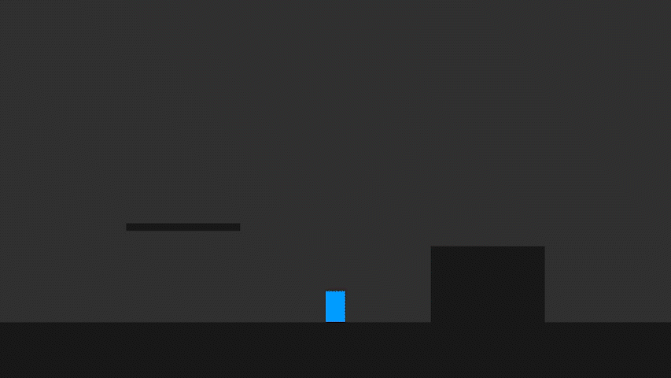
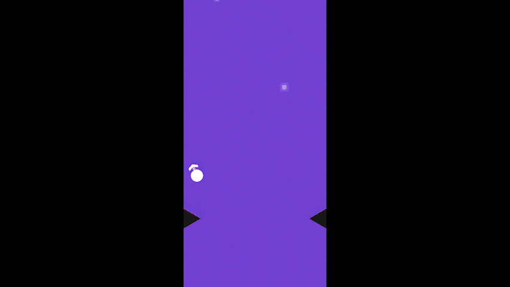
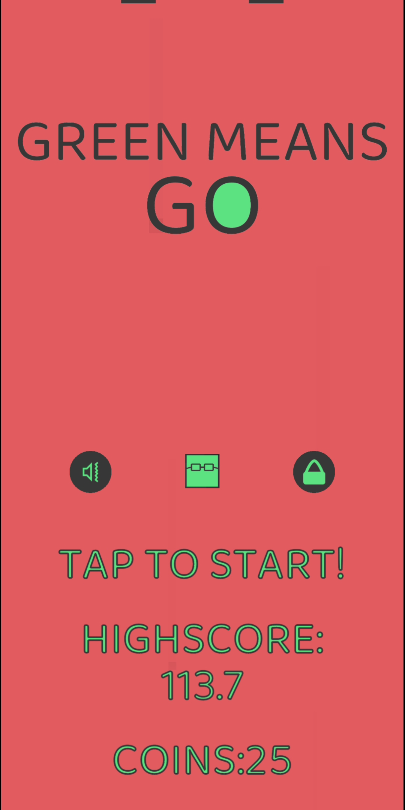

### Hi there, I'm Axel 👋🏻

I work on a lot of different things, but predominantly spend my time in Unity.

I enjoy working on all kinds of games, if you have any questions feel free to contact me!

<h1 align="center">Connect</h1>

  
  
  

<h1 align="center">Projects</h1>
<table bordercolor="#66b2b2">
  <tr>
  <td width="50%" valign="top">
      <h3 align="center">HexMC</h3>
       
        
       
        

  
  
      

        
A Minecraft clone, but using hexagonal voxels

    </td>
    <td width="50%" valign="top">
      <h3 align="center">Obu</h3>
         
      
         
        

          
  
  
      

        
A Snake-inspired tile based puzzle game with a level editor

    </td>
  </tr>
  
  <tr>
        <td width="50%" valign="top">
      <h3 align="center">Astrala</h3>
         
        
         
        

          
  
      

        
A survival adventure game featuring a procedurally generated hexagonal voxel world

    </td>
    <td width="50%" valign="top">
      <h3 align="center">DrawConway</h3>
         
        
         
        

          
  
  
      

        
A cellular automata drawing website

    </td>
  </tr>
    <tr>
        <td width="50%" valign="top">
      <h3 align="center">Fogwalk</h3>
         
        
         
        

          
  
      

        
A PS1-style first-person horror game concept

    </td>
              <td width="50%" valign="top">
      <h3 align="center">B-W</h3>
         
        
         
        

          
  
      

        
A 2D action platformer with combat and puzzle elements

      </td>
  </tr>
      <tr>
        <td width="50%" valign="top">
      <h3 align="center">Mandarin Learning</h3>
         
        
         
        

          
  
      

        
A mobile app I made to help me learn Mandarin while I lived in Taiwan

    </td>
    <td width="50%" valign="top">
      <h3 align="center">Dialogue</h3>
         
        
         
        

          
  
      

        
An attempt at making a dynamic dialogue system with easy to add animations

    </td>
  </tr>
        <tr>
        <td width="50%" valign="top">
      <h3 align="center">Platformer Controller</h3>
         
        
         
        

          
  
      

        
A simple player controller used to teach animations and game feel

    </td>
    <td width="50%" valign="top">
      <h3 align="center">HexTerrain</h3>
         
        
         
        

          
  
      

        
Easily customizable procedural hexagonal terrain meant for a isometric viewpoint

    </td>
  </tr>
          <tr>
        <td width="50%" valign="top">
      <h3 align="center">Tanks</h3>
         
        
         
        

          
  
      

        
A silly concept Tank game where you move by propelling yourself with your own bullets

    </td>
    <td width="50%" valign="top">
      <h3 align="center">Hooked</h3>
         
        
         
        

          
  
      

        
Simple endless one tap mobile game concept

    </td>
  </tr>
            <tr>
<td width="50%" valign="top">
      <h3 align="center">Green Means Go</h3>
         
        
         
        

          
  
  
      

        
A simple mobile game made and published in 2 days

    </td>
    <td width="50%" valign="top">
      <h3 align="center">Dungeon</h3>
         
        
         
        

          
  
      

        
A one-tap mobile game concept with enemies, dodging, and attacking

    </td>
  </tr>
</table>
